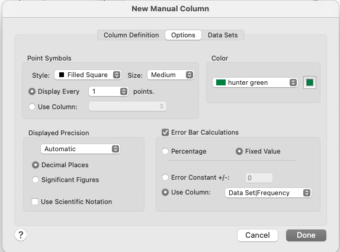

---
jupytext:
  formats: md:myst
  text_representation:
    extension: .md
    format_name: myst
kernelspec:
  display_name: Python 3
  language: python
  name: python3
---

# Lab 2

Here are some stuffs for lab2!

____


## Overview

- This lab might look a little intimidating but it will turn out pretty chilled.

- It might take some time!

- Relax and you can do it!


## Part 1: Tension Calculation
- This is straightforward. And I hope everyone now knows how to calculate this. 
```{tip}
Go back to pre lab 2 tension equation(2) for help!
```


## Part 2: Natural frequency & Pitch

- Basically, it is ***resonance*** in oscillations.

- One real-life example: When you push your friend on a swing, you notice that if you push them at a certain frequency(tho you count the seconds - motion period), the swing would fly higher!

- One more term to be familiar with is ***natural frequency***. Now, you should be able to answer these questions.

```{note}
Objects (every? maybe) has natural frequency, in which it oscillate without any directly applied forces.
```


## Part 3: Frequency Extraction

- Now, there are **6 videos** corresponding to the number of anti-nodes in each case.

- All you want to extract is <font color='red'><b>range of frequency that the string has the largest amplitude</b></font>.

- <mark>Steps to do that</mark>:
    - Step 1: Play the video. Of couse heh!
    - Step 2: Notice the first frequency mark that the string oscillates largely.  Record error (~$\pm{0.2} Hz$).
    - Step 3: Notice the frequency mark that the string appears to "shrink". Record error (~$\pm{0.2} Hz$).
    - Step 4: Take the average to find the approximated frequency (according to the lab manual). Find the error of averaging.

- Enter your data in page 1.

```{caution}
Listen carefully. Some frequency readings increases while other decreases. Why? Dr. H's choice? No idea.
```
    


## Part 4: Calculate $\lambda$

- You have to calculate $\lambda$ from **# of aninodes** and **length of string**. Sound familiar?

- Enter your data to the table in page 1.

<!-- #region -->
## Part 5: Plot and linear Fit

- In this part, you will have to plot your data in Logger Pro.
- <mark>Steps to plot your data</mark>:
    - Enter values of "n" to X column. Enter the values of frequency to Y column. (go back to Pre lab 1)
    - Create a new column: 
        - **Select Data > New Manual Column > Options header**.
        - **Check Error bar calculations**.
        - **Select Fixed value**.




- Here is an demonstration of what your graph might look like:
<!-- #endregion -->

```{code-cell} ipython3
:tags: [hide-input]
import altair as alt
import pandas as pd
import numpy as np

data = pd.read_csv('../../data/lab2.csv', delimiter=',').rename(columns={'Number of Anti_nodes': 'n', 'f (Hz)': 'f','f error (Hz)': 'f_error'})

chart = alt.Chart(data, height=300, width=300).mark_circle(
    color='teal', 
    size = 70, 
    opacity=0.6,
).encode(
    x=alt.X('n:Q', title='Number of antinodes',scale=alt.Scale(domain=(0, 7))),
    y=alt.Y('f:Q', title='Frequency (Hz)',scale=alt.Scale(domain=(0, 100)))
).properties(
    title='Frequency vs Number of antinodes'
)

# Generate regression line
linear_fit=chart.transform_regression('n', 'f', method='linear').mark_line(color="red",strokeDash=np.array([3,3]))

# # generate the error bars
errorbars = chart.mark_errorbar(extent='stderr').encode(
    x=alt.X('x:Q'),
    yError=alt.YError(field='f_error:Q')
)

# Display the chart
alt.layer(chart,linear_fit, errorbars).interactive()
```

```{caution}
This is just a demo. Your graph should be in Logger Pro, which might look different! But it might give u a sense of what the values should be!
```


## Part 6: Calculate $\mu$

- Calcute $\mu$ from the slope of best fit line. Sound familiar?

```{tip}
Go to pre lab 2 again!
```


## Part 7: Describe observations

- There are **3 videos** to watch and answer related questions in the report sheet.

- Basically, the first two include Dr. H striked a strobe light (don't worry about what it is!) with frequency of 30 Hz and 60Hz. The third one is just him touching the string at nodes and antinodes.

- What you need to do is <mark>describe how the string behaved in each case</mark>.

```{tip}
Listen carefully! Dr. H gave away the explanation as he did the experiment!
```


## Data Collection and Analysis

````{margin}
```{error}
Excel sheet has an error on velocity column!
````
-  Complete table for page 1 (Part 1,3,5,6). The below excel sheet will help you!
- [Download Excel Template](https://docs.google.com/spreadsheets/d/e/2PACX-1vRAQbU1WT9LTW74JDTUguWd6Vcxvokxwkpgg5uOfV9XhA0Z3NokKYqnrwWIyuTdEVlFbwMzPE9xcfkF/pub?output=xlsx)


## Uncertainties Calculation

- You have to show me how you calculate the uncertainties in Part 1 via **an example with actuall values**.

- **I would recommend doing it without Excel Sheet for practice!**


## Discussion Question

- Basically, you need to explain: At the point in contact of the vibrator (which was vibrating/moving), why is that point consider a node?

- Here is a illustration for you:


- One more thing he asks is how you would reduce such error about that assumptions.

```{tip}
Just use common sense!
```


## Recordings

- Lab Procedure. [Click Here](https://ubc.zoom.us/rec/share/KxPjPEo_hgUsVKjzZz9SWcQvwHCNEHhe7MPT7S-M7yBnZ5ZsD433fsmaARgTKBS2.TUJqnxWHEjOx9LmC)


